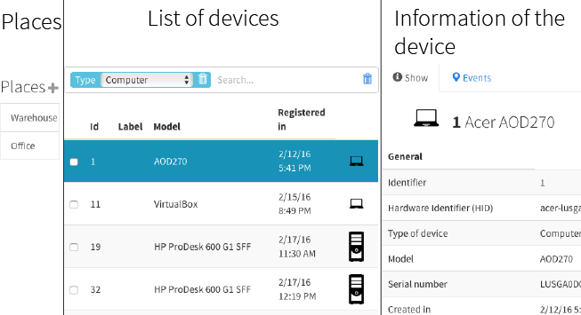
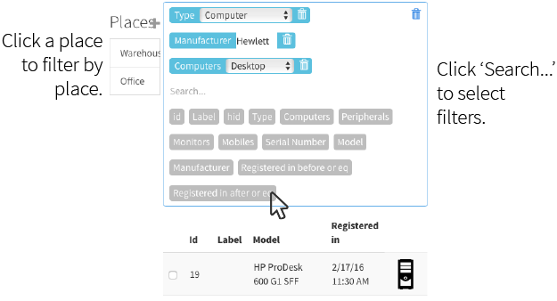
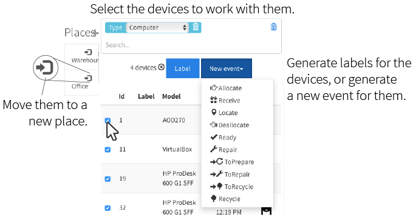
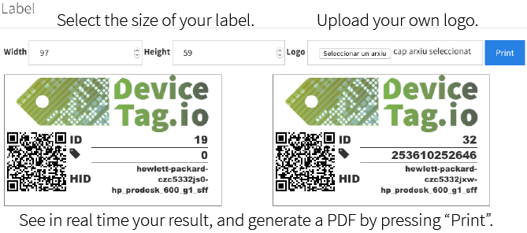
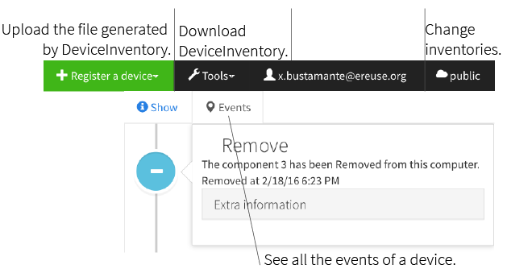

# DeviceHubClient
DeviceHubClient is a client for [DeviceHub](https://github.com/eReuse/DeviceHub).

## Introduction
DeviceHub manages inventories of devices -such as computers or smartphones. 
You register them using our automated open-source tools, place them in different places (ex. the warehouse), 
and perform events to them (ex. "this device has been repaired", "we have moved the device to
the office of the client", etc.). With the [Android App](https://play.google.com/store/apps/details?id=org.ereuse.scanner)
you can efficiently work with hundreds of devices.

### The web app
Once you login to your DeviceHub you will see a workplace, like this one, but empty:



When working with hundreds (or thousands) of devices one of the most important tasks is to have them under control.
We welcome you to our powerful search:



We wanted to do a simple but powerful way to work with the devices. Just "click the checkbox" and the options will appear ;-)



So many events can be confusing. Click them to know what they do. You can get more *techy* info [here](https://wiki.ereuse.org/arch:events).

For example, you can label the devices. This is important to fast locate them after.



Some final thoughts: 
* On the right up menu you can register the devices generated by [our tools: DeviceInventory](https://github.com/eReuse/device-inventory/releases/latest).
* You can have many inventories, and they are totally isolated. Another organization can even invite you to their inventory!



This is just a sneak peak of some things DeviceHub(Client) can do.

## Technical stuff
### Requirements
* Angular
* Bower: Many other packages bundled in the file bower.json
* npm: One package bundled in package.json

### Installation
1.  Install bower. You will need to install before [node](https://github.com/nodejs/node-v0.x-archive/wiki/Installing-Node.js-via-package-manager), npm and git.
2.  Download this project from github.
3.  In the folder of the project, execute:
    ```
    bower install bower.json
    ```
    This will install the dependencies of the project.
4. If using Apache 2, an example config is:
    ```
    <VirtualHost *:80>
        ServerName www.example.com

        DocumentRoot /absolute/path/to/project/folder

        <Directory /absolute/path/to/project/folder>
            Order allow,deny
            Allow from all
            Require all granted

            <IfModule rewrite.c>
                # Optional. HTML5 mode
                RewriteEngine on
    
                # Don't rewrite files or directories
                RewriteCond %{REQUEST_FILENAME} -f [OR]
                RewriteCond %{REQUEST_FILENAME} -d
                RewriteRule ^ - [L]
    
                # Rewrite everything else to index.html to allow html5 state links
                RewriteRule ^ index.html [L]
            </IfModule>
            
            <IfModule mod_expires.c>
                # Optional. Cache control
                ExpiresActive On
                ExpiresDefault "access plus 2 hours"
            </IfModule>
        </Directory>
        #LogLevel debug
    </VirtualHost>
  ```
  This config includes the necessary to work with HTML5 mode, and using a cache. Use [this page](http://www.control-escape.com/web/configuring-apache2-debian.html)
   to know how to install the modules.
5.  Set the url in the constants of Config.js to whatever URL the DeviceHub is in.
