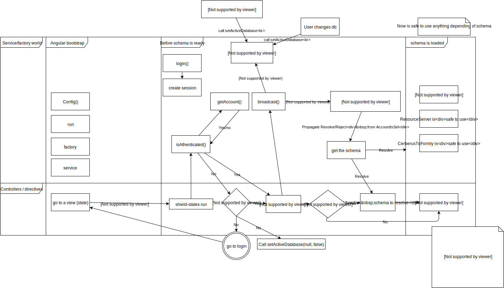
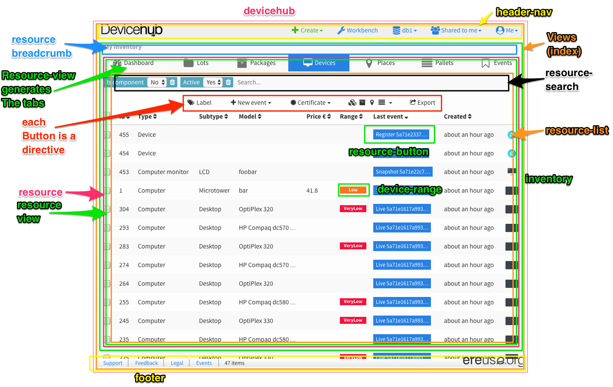

# Introduction
DeviceHubClient, abbreviated DHC, is divided in a few `views`, which map with an URI. The views
are, generalizing, `logging`, `inventory`, and `workbench`.

## App bootstrap process
When an user loads the app page...
1. It loads a mini web-site bundled inside the html that shows a background, logo and loading bars,
   with all the style.
2. Gets the javascript, which takes a while to get, while filling the loading bar.
3. Loads the javascript scripts, loading ultimately Angular and the DeviceHub Angular module, which
   is the main one.
4. The DeviceHub module sets the views and kicks the url routing, detecting the written URL where
   the page is loaded and checking if there was a saved user in the browser storage. It loads a
   different view depending on this. For example, if no user is saved it goes to the `logging`
   view, if the URL is `/:db/workbench` and there is a saved user it goes to the Workbench view.
   The module `common.components.authentication` takes care of this.
5. The majority of views access resources from DeviceHub, like devices.
   DeviceHubClient needs to load a schema (from `common.config`) from server with the information
   of all resources prior to operate with them. For example, DeviceHubClient generates forms
   extracting the information from the schema. This is done automatically after getting an user 
   (by performing logging or by reading it from the browser), and views wait for the schema to be
   loaded. Check this in the `resolve` statements of the `deviceHub` module. Other services require
   the schema indirectly through `ResourceSettings` and use `ResourceServer` to access `DeviceHub`;
   those modules are part of `common.components.resource`.
6. Once the schema is loaded the view loads. A view in the end is a simple HTML with lots of
   Angular directives bundled inside other Angular directives, with services/factories supporting
   them. Those are in `common/components` and represent the majority of the application.
   
You have a more detailed example of how main services and controllers run in the following image:

Check the inline documentation of each module to understand how they work.

## App nesting directives and controllers
In DeviceHubClient we prefer using directives to controllers, relegating controllers to views,
as they are needed by Router.UI to interface with the URL directly. Directives are reusable,
more concise and, (by using a library) can be recursive and nested, and we almost always
isolate them.

The following image illustrates the main directives and controllers by using boxes,
from the `inventory` view and *device* tab:

## Style and CSS
DeviceHubClient uses a slightly modified [Cosmo](https://bootswatch.com/cosmo/) bootswatch
Bootstrap 3 theme. Bootstrap style settings are set in `common/styles/_variables.sass` and the
`common/styles/app.sass` is a kind of main stylesheet. We say *kind* because our SASS
implementation gathers all stylesheets, bundles them together and compiles them.

As a rule, everything on this app uses Bootstrap and the variables set in `_variables`,
making it easy to tune colors, fonts, etc. Only some third-party libraries can be extend of
this rule, and we try to replace their non-bootstrap stylesheets when possible.

We use all icons we can from the bundled [Font Awesome](http://fontawesome.io), instead of
the Bootstrap's default glyphicons (which we removed from our project); and then other icons
from [Flat Icon](https://www.flaticon.com).

## Building
We use `Browserify` to build the app alongside some other modules that you can see in the
`gulpfile.js`. The building generates the following code in a `dist` folder:
- `common/assets/common` folder with images and miscellaneous files.
- `css` folder with `vendor.css`, boundling third-party CSS.
- `index.html` file with the mini-website described in *Angular Workflow 1*, `devicehub`
  module code, typical `html` tags and our CSS (that comes from SASS) inlined in a header tag.
- `fonts` with Font Awesome icons.
- `js` folder:
  - `bundle.js`, containing our javascript code, with or without a sourcemap depending of the
    type of build.
  - `vendor.js`, containing third-party javascript code, like AngularJS.
- `favicon` images.
- `templates.js`. A file containing angular templates when using the deprecated `templateUrl`
  property in directives (we should use `template` and `require` the template).
